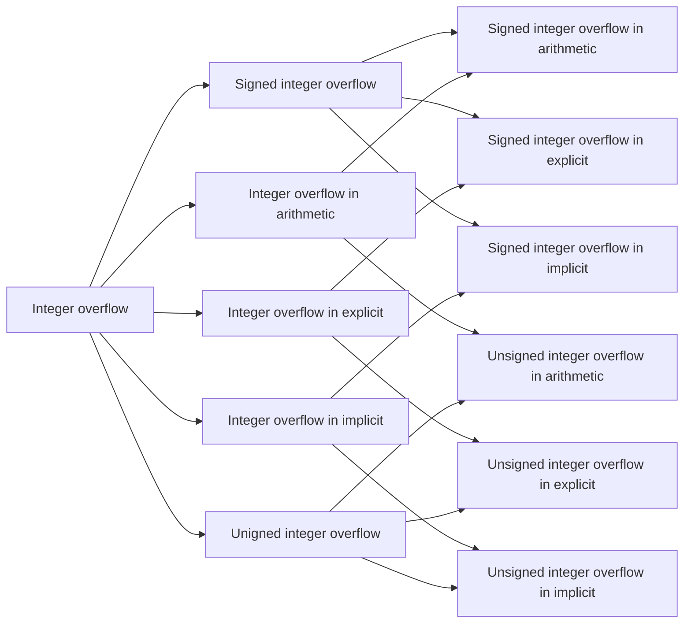

```mermaid
%% should be TB but LR is more readable with long labels
flowchart LR
    iof[Integer overflow]

    siof[Signed integer overflow]
    uiof[Unigned integer overflow]
    iof --> siof & uiof

    iofa[Integer overflow in arithmetic]
    iofe[Integer overflow in explicit]
    iofi[Integer overflow in implicit]
    iof --> iofa & iofe & iofi

    siofa[Signed integer overflow in arithmetic]
    siofe[Signed integer overflow in explicit]
    siofi[Signed integer overflow in implicit]
    uiofa[Unsigned integer overflow in arithmetic]
    uiofe[Unsigned integer overflow in explicit]
    uiofi[Unsigned integer overflow in implicit]
    %% order of these seems to matter for nice rendering
    siof --> siofa & siofe & siofi
    iofa --> siofa & uiofa
    iofe --> siofe & uiofe
    iofi --> siofi & uiofi
    uiof --> uiofa & uiofe & uiofi
```
