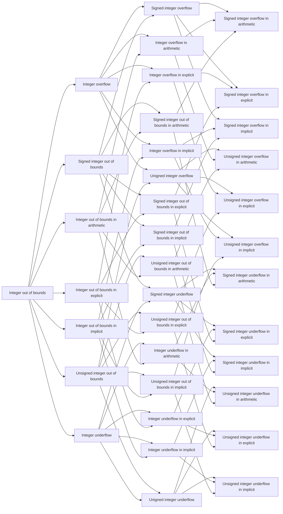

```mermaid
%% should be TB but LR is more readable with long labels
flowchart LR
    ioob[Integer out of bounds]

    iof[Integer overflow]
    iuf[Integer underflow]
    ioob --> iof & iuf

    sioob[Signed integer out of bounds]
    uioob[Unsigned integer out of bounds]
    ioob --> sioob & uioob

    iooba[Integer out of bounds in arithmetic]
    ioobe[Integer out of bounds in explicit]
    ioobi[Integer out of bounds in implicit]
    ioob --> iooba & ioobe & ioobi

    siof[Signed integer overflow]
    uiof[Unigned integer overflow]
    siuf[Signed integer underflow]
    uiuf[Unigned integer underflow]
    %% order of these seems to matter for nice rendering
    iof --> siof & uiof
    sioob --> siof & siuf
    uioob --> uiof & uiuf
    iuf --> siuf & uiuf

    iofa[Integer overflow in arithmetic]
    iofe[Integer overflow in explicit]
    iofi[Integer overflow in implicit]
    iufa[Integer underflow in arithmetic]
    iufe[Integer underflow in explicit]
    iufi[Integer underflow in implicit]
    iof --> iofa & iofe & iofi
    iuf --> iufa & iufe & iufi
    iooba --> iofa & iufa
    ioobe --> iofe & iufe
    ioobi --> iofi & iufi

    siooba[Signed integer out of bounds in arithmetic]
    sioobe[Signed integer out of bounds in explicit]
    sioobi[Signed integer out of bounds in implicit]
    uiooba[Unsigned integer out of bounds in arithmetic]
    uioobe[Unsigned integer out of bounds in explicit]
    uioobi[Unsigned integer out of bounds in implicit]
    sioob --> siooba & sioobe & sioobi
    uioob --> uiooba & uioobe & uioobi
    iooba --> siooba & uiooba
    ioobe --> sioobe & uioobe
    ioobi --> sioobi & uioobi

    siofa[Signed integer overflow in arithmetic]
    siofe[Signed integer overflow in explicit]
    siofi[Signed integer overflow in implicit]
    siufa[Signed integer underflow in arithmetic]
    siufe[Signed integer underflow in explicit]
    siufi[Signed integer underflow in implicit]
    uiofa[Unsigned integer overflow in arithmetic]
    uiofe[Unsigned integer overflow in explicit]
    uiofi[Unsigned integer overflow in implicit]
    uiufa[Unsigned integer underflow in arithmetic]
    uiufe[Unsigned integer underflow in explicit]
    uiufi[Unsigned integer underflow in implicit]
    siof --> siofa & siofe & siofi
    uiof --> uiofa & uiofe & uiofi
    siuf --> siufa & siufe & siufi
    uiuf --> uiufa & uiufe & uiufi
    iofa --> siofa & uiofa
    iofe --> siofe & uiofe
    iofi --> siofi & uiofi
    iufa --> siufa & uiufa
    iufe --> siufe & uiufe
    iufi --> siufi & uiufi
    siooba --> siofa & siufa
    sioobe --> siofe & siufe
    sioobi --> siofi & siufi
    uiooba --> uiofa & uiufa
    uioobe --> uiofe & uiufe
    uioobi --> uiofi & uiufi
```
